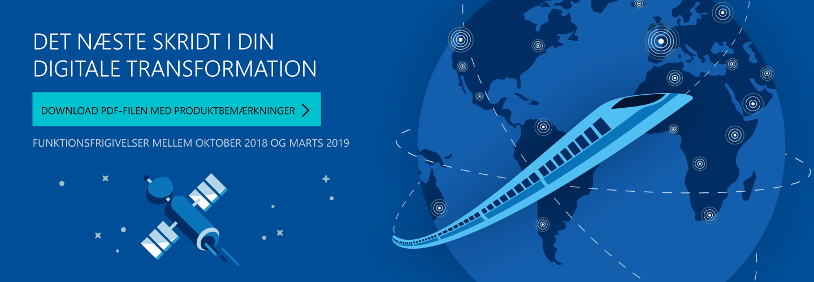

# Oversigt over produktfrigivelsen fra oktober 2018

[!include[banner](../includes/banner.md)]

[Hent PDF-filen med Produktbemærkninger fra oktober 2018](https://go.microsoft.com/fwlink/?linkid=2005971&clcid=0x406) (sidst opdateret 23-07-2018)

Produktfrigivelsen fra oktober 2018 til Virksomhedsprogrammer indeholder vigtige funktioner, som du kan bruge til at transformere din virksomhed. De første af disse nye tjenester og funktioner bliver gjort tilgængelige i begyndelsen af oktober 2018.

- **Forbedringer af Dynamics 365-programmer** omfatter hundredvis af nye funktioner på tværs af Sales, Marketing, Customer Service, Portals, Omni-channel Engagement Hub, Field Service, Project Service, Social Engagement, Finance and Operations, Talent, Retail og Business Central. Vi introducerer et nyt sæt mixed reality-oplevelser ved hjælp af Microsoft Layout og Microsoft Remote Assist.

- **Nye intelligensprogrammer** udnytter årtiers AI-arbejde, der er udviklet af Microsoft Research, til at gøre Dynamics 365 mere intelligent. Du kan forbedre salgsresultater og -planlægning med det nye Dynamics 365 AI for Sales-program. 

- **Nye funktioner til Power-platform** kombinerer Power BI, PowerApps, Microsoft Flow, Common Data Service til apps og Power BI-dataflows i en overlegen værktøjspakke, der kan udvide, tilpasse og integrere Dynamics 365 og Office 365 i dit miljø. 

- **Dataintegration** leverer indbygget forbindelse til Power-platformen og meget mere, med data på tværs af hundredvis af forretningssystemer, som åbner for udbytterige og intelligente oplevelser. Common Data Model giver semantisk ensartethed i kanoniske forretningsobjekter på tværs af Dynamics 365, Common Data Service til apps og Power BI-dataflows med øget "time to value" for programudviklere, uafhængige softwarepartnere og integratorer.

- **Dybere integration med andre Microsoft-produkter** giver problemfrie oplevelser med Dynamics 365 og Microsoft Outlook, Teams, SharePoint, Stream, Azure og LinkedIn. Vi har forbedret Dynamics 365 med data og signal fra Office 365 og Bing.

- **Forbedringer af ydeevne, brugervenlighed og understøttelsesmuligheder** giver bedre programmer og en bedre underliggende platform, og du får en bedre oplevelse af din virksomhedsdrift.

Vi har gjort dette arbejde for at hjælpe jer – vores partnere, kunder og brugere – med at gennemføre den digitale transformation af jeres virksomhed på jeres vilkår.

Vi ser frem til at samarbejde med jer, når I begynder at implementere disse nye tjenester og funktioner, og vi gælder os til at høre fra jer, når I for alvor er kommet i gang med produktfrigivelsen fra oktober 2018.

Lad os høre din mening. Send en mail til <a href="mailto:releasenotes@microsoft.com">releasenotes@microsoft.com</a>. Din feedback bruges til at forbedre vores indhold.

